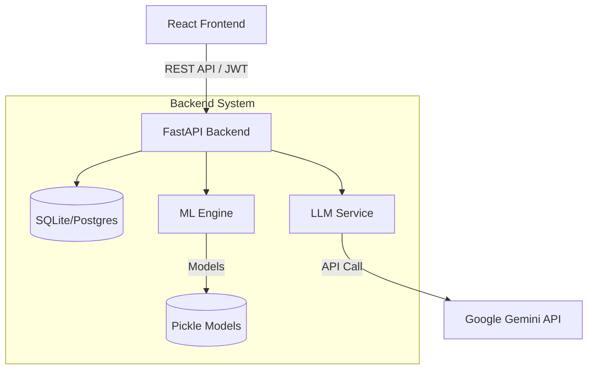

# Architecture Overview

JobMode is built on a modern, decoupled architecture designed for scalability, modularity, and ML integration. It follows a microservices-inspired monolithic pattern where the frontend, backend, and machine learning components operate cohesively but remain logically separated.

## High-Level System Architecture

## Core Layers

1. **Frontend Layer**: React 19 SPA served via Vite, using TailwindCSS for styling and Axios for data fetching. It provides distinct views based on RBAC (Student, Admin, PR).
2. **API Layer**: FastAPI handles routing, dependency injection (authentication), and Pydantic validation.
3. **Business Logic**: Controllers manage domain-specific operations (e.g., Placement Drives, Resume Parsing).
4. **Intelligence Layer**:
   - *Deterministic ML*: Scikit-learn/XGBoost pipelines for Profile Strength and Role Prediction.
   - *Generative AI*: LLM integration for Candidate Dossiers and Narrative Generation.
5. **Data Layer**: SQLAlchemy ORM manages relational data persistence.
